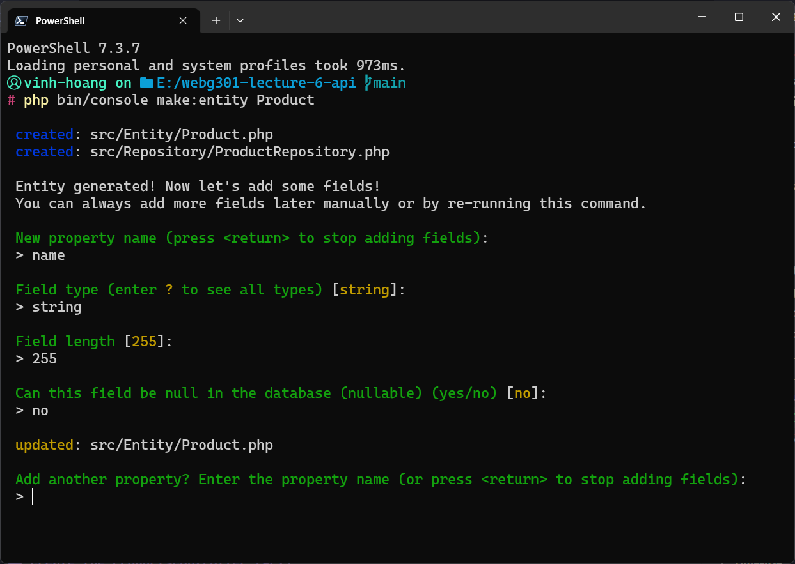

# Lecture 6: API

## Initialize the Project

Use the code below to initialize the project

```bash
symfony new -webapp webg301-lecture-6-api
```

Then you can navigate to the project and start the Visual Studio Code

```bash
cd webg301-lecture-6-api
code .
```

## Create the Product Model

Use the command below and follow the instructions to create the Product model

```bash
php bin/console make:entity Product
```




## Initialize the DATABASE_URL in the .env file

In the `.env` file, make sure to update the `DATABASE_URL`

```bash
# .env
DATABASE_URL=mysql://root:@127.0.0.1:3306/product_store?serverVersion=mariadb-10.4.11
```

## Create the Database

Now, make sure you start `MySQL` in `XAMPP`


Then, run the following command to create the database

```bash
php bin/console doctrine:database:create
```


Check `PHPMyAdmin` to see the `product_store` database


## Create the Migration

Now, the database is created. We need to create the table from the Model.

To do so, we need to create a migration first.

```bash
php bin/console make:migration
```


## Update the Database

Now, use the command below to start create the table

```bash
php bin/console doctrine:migrations:migrate
```


Check `PHPMyAdmin` to see the table


## Create the ProductsController (API)

Now, we will create the `ProductsController` as an API controller

First, create a new controller class named ProductsController using Symfony CLI:

```bash
php bin/console make:controller ProductsController
```


Open the `ProductsController.php` file and implement the CRUD operations for the `Product` entity

```php
<?php

namespace App\Controller;

use App\Entity\Product;
use App\Repository\ProductRepository;
use Symfony\Bundle\FrameworkBundle\Controller\AbstractController;
use Symfony\Component\HttpFoundation\Request;
use Symfony\Component\HttpFoundation\Response;
use Symfony\Component\Routing\Annotation\Route;
use Symfony\Component\Serializer\SerializerInterface;
use Symfony\Component\Validator\Validator\ValidatorInterface;

/**
 * @Route("/api/products", name="api_products_")
 */
class ProductsController extends AbstractController
{
    private $productRepository;   // Product repository for database interactions
    private $serializer;         // Symfony serializer for JSON handling
    private $validator;          // Symfony validator for data validation

    public function __construct(
        ProductRepository $productRepository,
        SerializerInterface $serializer,
        ValidatorInterface $validator
    ) {
        $this->productRepository = $productRepository;
        $this->serializer = $serializer;
        $this->validator = $validator;
    }

    /**
     * @Route("/", name="list", methods={"GET"})
     */
    public function list(): Response
    {
        // Retrieve all products from the database
        $products = $this->productRepository->findAll();

        // Serialize the products to JSON format
        $data = $this->serializer->serialize($products, 'json');

        // Return a JSON response with the products
        return new Response($data, Response::HTTP_OK, ['Content-Type' => 'application/json']);
    }

    /**
     * @Route("/{id}", name="show", methods={"GET"})
     */
    public function show($id): Response
    {
        // Retrieve product from the database
        $product = $this->productRepository->find($id);

        // Serialize the product to JSON format
        $data = $this->serializer->serialize($product, 'json');

        // Return a JSON response with the product
        return new Response($data, Response::HTTP_OK, ['Content-Type' => 'application/json']);
    }

    /**
     * @Route("/", name="create", methods={"POST"})
     */
    public function create(Request $request): Response
    {
        // Retrieve JSON data from the request
        $data = $request->getContent();

        // Deserialize the JSON data into a Product entity
        $product = $this->serializer->deserialize($data, Product::class, 'json');

        // Validate the incoming data
        $errors = $this->validator->validate($product);
        if (count($errors) > 0) {
            // Return a JSON response with validation errors if any
            return new Response($this->serializer->serialize($errors, 'json'), Response::HTTP_BAD_REQUEST, ['Content-Type' => 'application/json']);
        }

        // Persist the product to the database
        $entityManager = $this->getDoctrine()->getManager();
        $entityManager->persist($product);
        $entityManager->flush();

        // Return a success response
        return new Response(null, Response::HTTP_CREATED);
    }

    /**
     * @Route("/{id}", name="update", methods={"PUT"})
     */
    public function update(Request $request, $id): Response
    {
        // Retrieve JSON data from the request
        $data = $request->getContent();

        // Deserialize the JSON data into a Product entity
        $updatedProduct = $this->serializer->deserialize($data, Product::class, 'json');

        // Validate the incoming data
        $errors = $this->validator->validate($updatedProduct);
        if (count($errors) > 0) {
            // Return a JSON response with validation errors if any
            return new Response($this->serializer->serialize($errors, 'json'), Response::HTTP_BAD_REQUEST, ['Content-Type' => 'application/json']);
        }
        // Retrive the data from the database
        $product = $this->productRepository->find($id)

        // Update the product's properties
        $product->setName($updatedProduct->getName());
        $product->setPrice($updatedProduct->getPrice());

        // Flush the changes to the database
        $this->getDoctrine()->getManager()->flush();

        // Return a success response
        return new Response(null, Response::HTTP_NO_CONTENT);
    }

    /**
     * @Route("/{id}", name="delete", methods={"DELETE"})
     */
    public function delete($id): Response
    {
        // Retrieve the product from the database
        $product = $this->productRepository->find($id);

        // Get the entity manager and remove the product
        $entityManager = $this->getDoctrine()->getManager();
        $entityManager->remove($product);
        $entityManager->flush();

        // Return a success response
        return new Response(null, Response::HTTP_NO_CONTENT);
    }
}

```

## Test the API with Postman

### POST /products


### GET /products


### GET /products/{id}


### DELETE /products/{id}


### PUT /products/{id}


## Consume the API

Create a new action in your `ProductsController` to render the view:

```php
    /**
     * @Route("/view", name="products_view")
     */
    public function view(): Response
    {
        return $this->render('products/index.html.twig');
    }
```

Add the code below to the `products/index.html.twig` to consume the API

```twig
<!DOCTYPE html>
<html>
<head>
    <title>Products</title>
    <!-- Include jQuery for AJAX -->
    <script src="https://code.jquery.com/jquery-3.6.0.min.js"></script>
</head>
<body>
    <h1>Products</h1>

    <!-- Create a form to add new products -->
    <form id="add-product-form">
        <input type="text" id="name" placeholder="Product Name">
        <input type="text" id="price" placeholder="Product Price">
        <button type="button" onclick="addProduct()">Add Product</button>
    </form>

    <!-- Display a list of products -->
    <ul id="product-list">
        <!-- Product items will be displayed here -->
    </ul>

    <!-- JavaScript code for AJAX requests -->
    <script>
        $(document).ready(function() {
            // Call listProducts() when the page loads
            listProducts();
        });

           // Function to fetch and display the list of products
            function listProducts() {
                $.ajax({
                    url: '/api/products/',
                    method: 'GET',
                    success: function(products) {
                        // Clear the product list
                        $('#product-list').empty();

                        // Iterate through the products and display them
                        for (var i = 0; i < products.length; i++) {
                            $('#product-list').append('<li>' + products[i].name + ' - $' + products[i].price + ' <button onclick="deleteProduct(' + products[i].id + ')">Delete</button></li>');
                        }
                    }
                });
            }

        // Function to add a new product
        function addProduct() {
            var name = $('#name').val();
            var price = $('#price').val();

            // Create a JSON object for the new product
            var newProduct = {
                name: name,
                price: price
            };

            $.ajax({
                url: '/api/products/',
                method: 'POST',
                contentType: 'application/json',
                data: JSON.stringify(newProduct),
                success: function() {
                    // Clear the input fields
                    $('#name').val('');
                    $('#price').val('');

                    // Refresh the product list
                    listProducts();
                }
            });
        }

        // Function to delete a product
        function deleteProduct(productId) {
            $.ajax({
                url: '/api/products/' + productId,
                method: 'DELETE',
                success: function() {
                    // Refresh the product list
                    listProducts();
                }
            });
        }

        // Initial load: Fetch and display the list of products
        listProducts();
    </script>
</body>
</html>

```

Now, we have the page that can use the API to display the list of products and create a new product

Go to the `http://127.0.0.1:8000/api/products/view` to see the result


